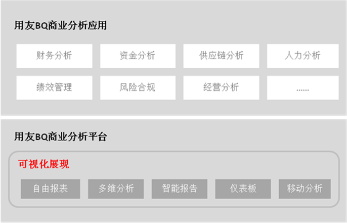
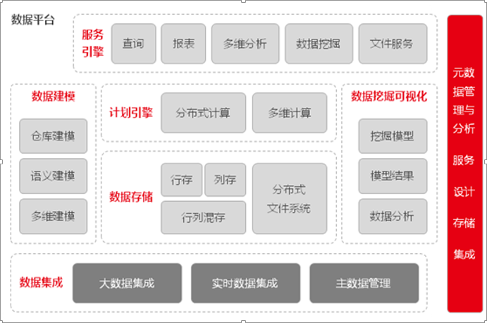

# 用友商业分析及大数据产品介绍

>来自：用友技术学院

>作者：艾尚坤

>连接：

>编辑:郭琪

## 商业分析 

通用的企业级商务智能分析平台，可独立部署，亦可与用友iuap集成部署，可支撑企业级商务智能分析应用。其面向的主要客户群体是用友集团旗下的各分析应用产品公司、分析应用咨询和开发伙伴，以及终端企业客户或公共组织。

高级分析平台*—DataInsight*提供高效的建模工具，帮助企业在大数据上进行数据挖掘，同时提供模型应用系统帮助企业整合从模型开发到模型上线的大数据挖掘落地的全过程，真正使得大数据挖掘能在企业轻松落地。 

	商业分析概述

商业分析是一个综合的商业分析平台产品和工具集，能够帮助企业将各类数据进行整合分析，并可通过查询、报表、报告、多维分析、仪表板、移动分析、嵌入式分析等丰富的可视化分析和展现方式为客户提供灵活直观的交互分析能力和信息展现能力。

	商业分析核心价值

作为企业级、全功能BI平台，可支撑企业级、行业、领域、产业链级商务智能分析应用。基于本平台的分析应用可实现在同一企业、行业、领域和产业链内进行迁移、共享、以及灵活扩展，可大大降低应用复用成本。

可满足企业对分析应用的实时性要求，大大提升企业管理和业务分析决策的敏捷反应能力，从而提高企业运营效率。可有效支撑大数据实时处理与分析，充分满足企业科学和快速精准决策对于信息的时效性和完整性要求。

作为平台级产品方案，可有效规避项目级方案应用交付和运维模式高成本的风险和问题。 

数据平台 

用友企业大数据平台是为了帮助企业处理分析内外部系统数据的一系列工具合集，能够支持对企业内部数据以及互联网相关数据的采集、存储、处理、分析、展现，包括结构化和非结构化数据，同时通过云服务和移动服务的形式增强了用户随时随地对数据进行分析的能力。

用友企业大数据平台涵盖了企业数据处理中数据的捕获、存储、计算、分析应用等领域。 

	数据平台概述

数据平台是用友企业级数据处理综合产品套件，它为企业提供涵盖建模、集成、数据质量、数据挖掘在内的一体化的数据管理解决方案。结合iuap 平台的主数据管理、ESB 等产品，可为企业提供从数据管理到数据治理的全面综合解决方案。

	数据平台核心价值

按照处理的数据模型，数据平台支持结构化大数据处理和非结构化大数据处理。按照数据分析的应用层次，平台支持了从报表展现，多维分析，数据挖掘，到决策支持等多个企业应用场景。同时通过采集外部数据，与内部数据结合，深度挖掘数据价值，为企业数据应用的深度和广度提供了有效的支撑。

用友基于 Hadoop 开源产品体系发布 UDH 产品，并围绕 UDH 开发了一系列解决企业大数据应用需求的产品和组件，使企业可实现大规模结构化、非结构化数据的集成、分析处理。通过与外部厂商合作，用友在 AE 内提供全功能的列式数据库产品，帮助企业存储和处理海量分析数据。 
