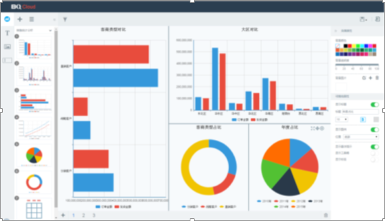
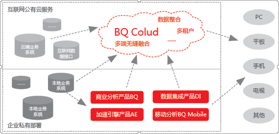
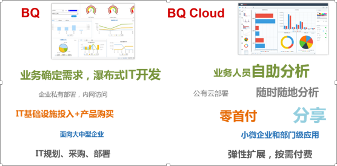

> 来自：用友技术学院
> 
> 作者：艾尚坤
> 
> 链接：http://udn.yyuap.com/doc/train/bigdata/bqcloud_md.html
> 
> 编辑: 郭琪

# BQ Cloud

## 一、 BQ Cloud是什么？

BQ Cloud是基于互联网公有云服务的一款商业分析产品，它是用友iUAP企业互联网开放平台产品中的一员。

BQ Cloud的**特点**用两个词概括就是“云端分析”以及“可视化”。

**云端分析**：用户可使用商业分析云服务而不需要在企业私有部署全套商业分析产品，从而无需前期IT投入即可采取租用DaaS（_DataasaService_）服务的方式开始企业的商业分析，使企业可以根据自身分析需要弹性扩展资源。

## 二、 BQ Cloud应用场景

BQ Cloud产品既可以接入用户私有部署的业务系统数据库及数据仓库，对于那些已经将业务系统转向公有云服务上的企业，BQ Cloud也可以接入云端数据仓库，从而帮助企业实现从业务到建模到分析的全程云计算服务。

_BQ Cloud分析界面图_

BQ Cloud 企业私有部署结构

## 三、 BQ Cloud不同于BQ8：

