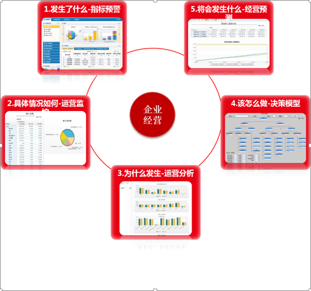
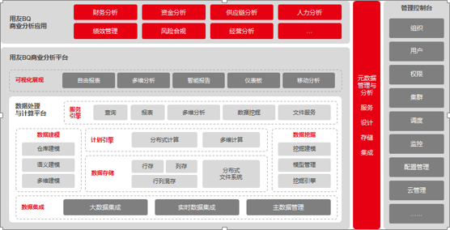
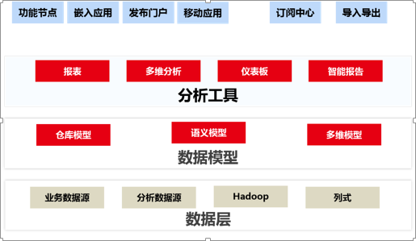

# 常规BI

### 应用目标：
**战略管控**：提高企业管理水平,实现企业集中管控；为领导提供核心业务和流程的经济指标分析，帮助领导全面掌握企业状况等，更全面、更准确支撑管理层决策。

**业务分析**：建立面向财务、销售，采购，库存，生产的业务分析主题，对企业的运营情况进行分析，以及支持生产运营管控和管理决策。

**风险预警**：构建层级清晰、准确、响应及时的客户信用分析、应收、应付预警指标； 对主要财务、销售，生产过程中风险进行预警，有利于领导有针对性地、预见性地做出应对战略与策略决策和布署。

### 客户价值：

（1）企业级、全功能BI平台，可支撑企业级、行业、领域、产业链级商务智能分析应用；

（2）基于本平台的分析应用可实现在同一企业、行业、领域和产业链内进行迁移、共享、以及灵活扩展，可大大降低应用复用成本；

（3）可满足企业对分析应用的实时性要求，大大提升企业管理和业务分析决策的敏捷反应能力，从而提高企业运营效率；

（4）作为平台级产品方案，可有效规避项目级方案应用交付和运维模式高成本的风险和问题。

### 产品结构：

### 实施模式：

