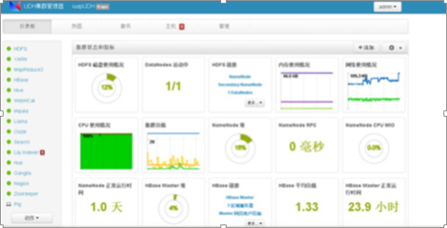
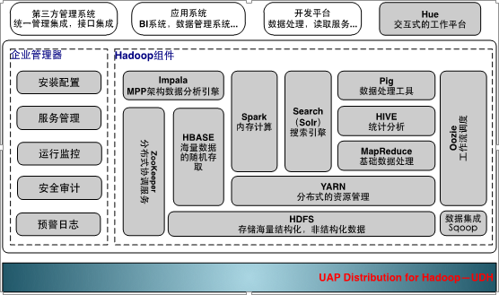

>来自：用友技术学院

>作者：艾尚坤

>连接：

>编辑:郭琪

# 大数据处理平台UDH

用友基于 Hadoop开源产品体系发布 UDH产品，并围绕 UDH 开发了一系列解决企业大数据应用需求的产品和组件，使企业可实现大规模结构化、非结构化数据的集成、分析处理及统一展现。

*UDH系统管理界面*

用友 UDH 在开源社区软件的基础上，包含了 Hadoop 大部分的主流组件，并且对这些组件在安全性，管理，性能，高可用等方面进行了优化。同时整合数据集成工具，集群管理和监控工具，增强了其企业级应用特性。让企业可以更快，更准，更稳地从各类繁杂无序的海量数据中洞察商机。

*UDH系统架构图*

## 主要特点：

（1）集群的安装部署，运维监控工具

（2）结构化数据，非结构化数据统一存储

（3）数据的批量，实时处理

（4）数据检索与内存计算

（5）SQL on Hadoop引擎加速BI大数据分析

