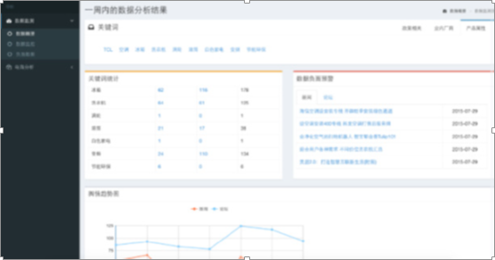
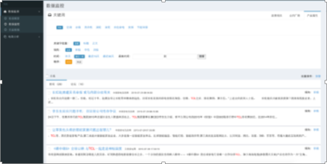
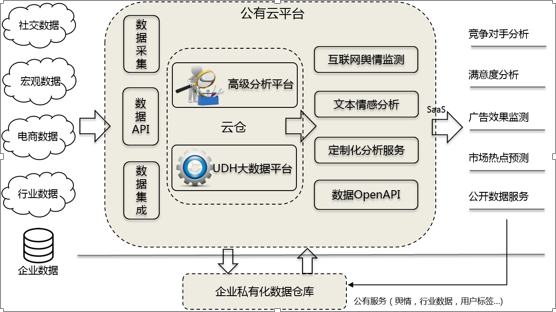

>来自：用友技术学院

>作者：艾尚坤

>连接：

>编辑:郭琪

# 大数据监测服务与分析服务Uradar

越来越多的企业将自身的业务系统通过互联网与其周边服务企业通过数据接口连接在一起，从产品的规划、研发、营销、渠道、物流、客户管理等多个方面不同程度的互联网化。伴随这些业务的展开，为了不断提升产品的竞争力，企业从原来的关注点从自身内部的生产制造流程，向更广大的互联网延伸平台转移，用友Uradar 产品就是为了满足企业在这方面的需求而诞生。

*URadar互联网监控与分析平台——分析与监控界面*

*URadar互联网监控与分析平台——舆情监控界面*

Uradar 平台基于用友UDH 大数据管理平台，结合自身研发的互联网数据挖掘分析服务，通过开放数据接口或智能信息检索技术搜集社交数据、宏观经济数据、电商平台数据、行业公开数据等数据到云端数据仓库，将企业关注的互联网开放数据收集整合，为企业提供包括舆情监控、营销分析、危机公关、产品评价等能力，帮助企业利用大数据充分获取竞争力。

## Uradar应用架构：

*URadar互联网监控与分析服务应用架构*

###1. 核心技术：

（1）全网媒体的数据抓取

（2）关键词定制搜索

（3）文本处理与挖掘分析

（4）文本的情感分析（负面）

###2. 主要功能

（1）根据关键词定制监测报告

（2）负面舆情的告警

（3）行业市场信息走向

（4）竞品／对手动态

（5）定制化分析
