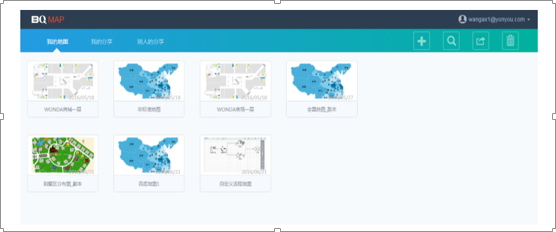
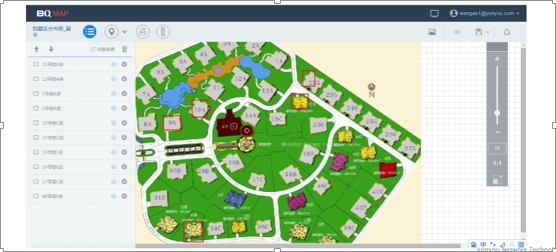

>来自：用友技术学院

>作者：艾尚坤

>连接：

>编辑:郭琪

# 地图分析

**BQ Map**是为实现标准地图和自定义地图的分析，以便更好的服务与商业分析平台。支持地图的新建、保存、删除和分享，支持对地图区域的拾取和标记功能，支持数据的导入导出。导出包支持嵌入到仪表板并提供数据、预警、事件接口。

## 地图功能

###1. 地图首页

提供地图编辑器的注册、登录以及部分小案例的演示环境。

###2. 地图Home

主要功能新增地图、查询已有地图、分享/下载做好的地图、删除已有的地图

###3. 地图编辑器

对逻辑概念地图或经纬度地图进行编辑。包括：区域拾取、数据添加、指标样式等。

