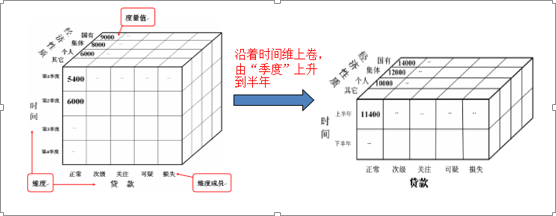
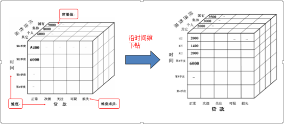
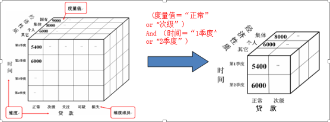
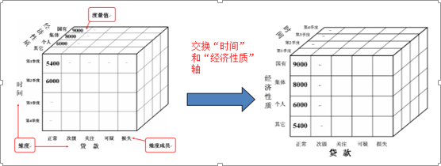
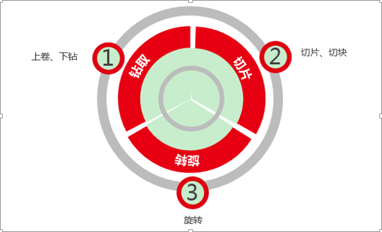

# 多维数据分析交互

上卷、下钻

上卷是在数据立方体中执行聚集操作，通过在维级别中上升或通过消除某个或某些维来观察更概括的数据。 

下钻是通过在维级别中下降或通过引入某个或某些维来更细致的观察数据

切片、切换

切片：在给定的数据立方体的一个维上进行的选择操作。切片的结果是得到了一个二维的平面数据

切换：在给定的数据立方体的两个或多个维上进行的选择操作。切块的结果是得到了一个子立方体

旋转

旋转：转轴就是改变维的方向

