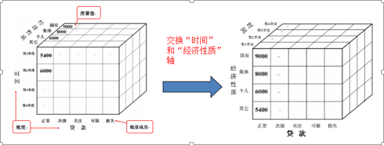

> 来自：用友技术学院
> 
> 作者：艾尚坤
> 
> 链接：http://udn.yyuap.com/doc/train/bigdata/duowei_fen_xi_md.html
> 
> 编辑: 郭琪

# 多维分析

**多维分析**主要是对多维模型数据，运用不同的分析角度和方法，以表格、图表的数据展现方式，为业务用户发现数据规律、解答业务问题提供支持；多维分析主要适用于解决实时性强、周期性弱，汇总性强、分析性强、展现模板格式要求不复杂的业务应用。

透视表全方位支持多维交互和展现，包括常规多维钻取与系列动态分析，以及公式、快照、链接、参数等丰富的报表特性应用。

## 1. 其主要功能有

### 1.1基础功能

新建
发布
订阅

### 1.2 设计功能

创建透视区域

分析上下文

透视表属性设置

报表参数

报表变量

公式定义

MDX脚本执行器

报表链接

### 1.3 分析功能

交互操作

动态分析

分列显示

条件格式

视觉样式

### 1.4 图表功能

图表类型

图表分类

图表属性

图表联动

图表链接

### 1.5 Adhoc

Adhoc查询创建

Adhoc查询设置

Adhoc分析操作

Adhoc属性设置

## 2.  多维数据分析交互

### 2.1  上卷、下钻

**上卷**是在数据立方体中执行聚集操作，通过在维级别中上升或通过消除某个或某些维来观察更概括的数据。

**下钻**是通过在维级别中下降或通过引入某个或某些维来更细致的观察数据

### 2.2  切片、切换

**切片**：在给定的数据立方体的一个维上进行的选择操作。切片的结果是得到了一个二维的平面数据

**切换**：在给定的数据立方体的两个或多个维上进行的选择操作。切块的结果是得到了一个子立方体

### 2.3  旋转

**旋转**：转轴就是改变维的方向

