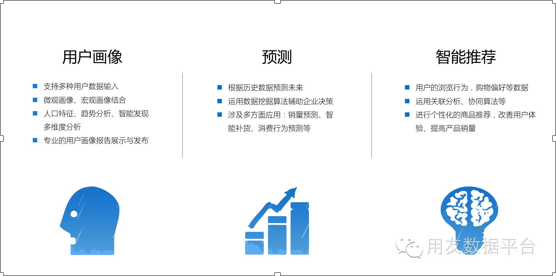
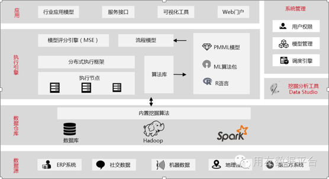
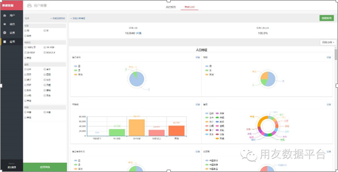
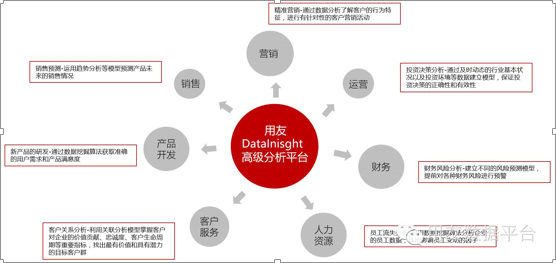

> 来自：用友技术学院
> 
> 作者：艾尚坤
> 
> 链接：http://udn.yyuap.com/doc/train/bigdata/ggaoji_fen_xi_md.html
> 
> 编辑: 郭琪

# 高级分析

## 用友DataInsight高级分析平台---你的数据应用专家

### 高级的分析指的是？

**Gartner**是这样解释的：**高级分析**是使用复杂的技术或者数据挖掘工具来分析数据。通常比传统的BI工具可以更深入地洞察数据，并对未来进行预测以及辅助决策。高级分析技术包括数据\/文本挖掘、机器学习、模式匹配、预测、可视化、语义分析、情感分析、网络与聚类分析、多元统计分析、图像分析、模拟、复杂事件处理、神经网络等（[http:\/\/www.gartner.com\/it-glossary\/advanced-analytics\/）](http://www.gartner.com/it-glossary/advanced-analytics/）)

而用友DataInsight高级分析平台，是以机器学习算法引擎为基础，依靠强大的数据平台分析能力，面向不同行业企业客户提供场景化的数据应用解决方案。

## DataInsight产品体系包括：

**DataInsight客户端**\(_Data Studio_\)：覆盖数据的探查，预处理，建模，评估，可视化的完整处理流程，提供专业化的数据挖掘解决方案。

**  DataInsightServer**：作为业务系统中模型算法的统一计算服务平台，提供项目管理，模型并行计算，工作流定时调度等能力，为业务系统的深入挖掘数据价值，智能化应用赋能。

**DataInsight应用中心**：基于企业真实业务场景的数据挖掘模型应用，如用户画像、销量预测、智能推荐等

_DataInsight 技术架构_

而我们这一次推出的**DataInsight应用中心的用户画像应用**，实现了

_DataInsight用户画像应用_

①        准确定位目标用户群

②        多维度的用户画像分析

③        直观的展示用户变化趋势

④        智能发现用户的群体特征

⑤        目标用户的详细标签导出

⑥        专业的分析报告制作以及快速分享
除此之外，用友DataInsight高级分析平台还渗透到**企业经营的各个环节**

_企业经营与DataInsight_

### 产品特性：

（1）大量预处理组件，可视化拖拽设计，支持完整的挖掘建模流程

（2）内置回归，分类，聚类，关联，时间序列等常见算法和分析模型，支持分布式并行计算，高性能的计算引擎

（3）集成定制的R引擎，3-5倍的性能提升。

（4）丰富的数据可视化组件和部署方式

（5）远程调度并行执行

