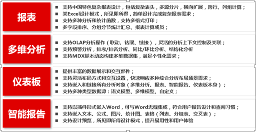

# 商业分析平台

## 用友商业分析平台是什么？

用友商业分析平台是基于 iUAP 平台，面向企业和公共组织的商业分析平台和应用套件。它是一个综合的商业分析平台产品和工具集，能够帮助企业将各类数据进行整合分析，并可通过查询、报表、报告、多维分析、仪表板、移动分析、嵌入式分析等丰富的可视化分析和展现方式为客户提供灵活直观的交互分析能力和信息展现能力。

用友BQ可与用友数据处理平台的产品配合使用，对业务数据进行建模与分析，也可独立部署与其他工具产品集成，帮助企业深度分析，获取数据价值。

### 各产品功能特点：

### 实施中产品的选择：
（1）**自由报表**
固定表格展现形式；
通过语义模型展现数据；
用户比较关注数据本身，比如数据的正确性，数据显示的格式、数据在报表中需要再次加工；

（2）**透视表**
表格数据需要钻取、展开、切换指标和维度；
明确的分析路径；
用户比较关注数据之间的关系；

（3）**仪表板**
因为可以嵌入，具备自由报表和透视表能力；
能够设置较复杂的交互方式和逻辑；
能够进行较随意的数据展现；

