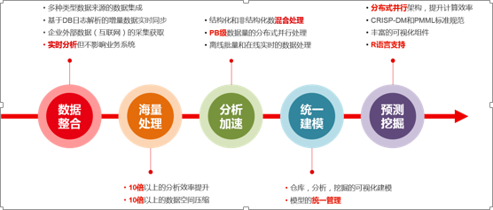

> 来自：用友技术学院
> 
> 作者：艾尚坤
> 
> 链接：http:\/\/udn.yyuap.com\/doc\/train\/bigdata\/shuju\_chu\_li\_ping\_tai\_md.html
> 
> 编辑:郭琪

# 数据处理平台

**用友数据处理平台**是支持企业计算关键技术的大数据平台，涵盖传统企业数据处理中数据的捕获、存储、计算、分析应用等领域。按照处理的数据模型，平台主要包括两个部分：结构化大数据处理和非结构化大数据处理。结构化和非结构化两部分产品可集成协同工作，也可以分别独立部署，可为企业提供专业的数据处理和分析计算解决方案，为满足企业复杂的大数据处理需求，提供企业级的产品和平台。

**用友数据处理平台**是用友企业级数据处理综合产品套件，它为企业提供涵盖建模、集成、数据质量、数据挖掘在内的一体化的数据处理和管理解决方案。结合iUAP 平台的主数据管理、ESB 等产品，可为企业提供从数据管理到数据治理的全面综合解决方案。

## 企业大数据分析应用特点：

