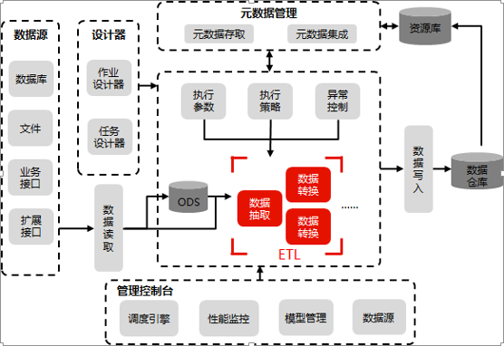

> 来自：用友技术学院
> 
> 作者：艾尚坤
> 
> 链接：http:\/\/udn.yyuap.com\/doc\/train\/bigdata\/shuju\_ji\_cheng\_gong\_ju\_di\_md.html
> 
> 编辑:郭琪

# 数据集成工具DI

**数据集成工具DI**可以应对企业结构化数据的ETL\/ELT需求，同时提供了数据质量处理相关组件和集群调度、日志监控等企业级数据能力。CDC基于数据库日志分析技术，可满足数据集成的实时性要求。结合iUAP平台其他产品，可提供企业ODS、数据仓库、企业数据总线等应用需求解决方案。
**主要特点**：

（1）支持丰富的数据源类型：数据库，文件，FTP，NoSQL等

（2）专有的数据转换组件：元数据，语义模型，批量加载等

（3）集群调度管理，执行过程监控

（4）并行执行提升效率

（5）大数据处理插件

