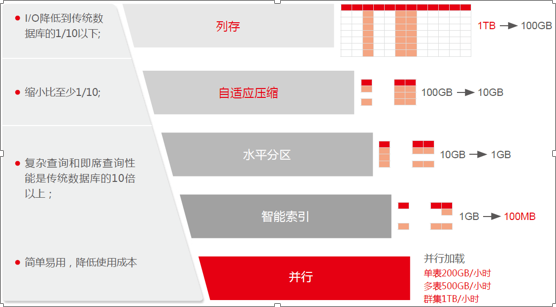

> 来自：用友技术学院
> 
> 作者：艾尚坤
> 
> 链接：http://udn.yyuap.com/doc/train/bigdata/shuju_jia_su_yin_qing_ae_md.html
> 
> 编辑: 郭琪

# 数据加速引擎AE

**数据加速引擎AE**主要包括2个模块，即实时数据同步工具（_Changed Data Capture， CDC_）和列式数据库。

CDC是基于日志分析和消息中间件技术，内部具有高缓存高并发的架构，实现了高性能的增量式数据复制和灵活的部署模型。CDC工具能够提供面向数据仓库的高效数据加载以及异构系统间数据的实时同步。

通过与全球知名厂商合作，用友在AE内提供全功能的列式数据库产品，帮助企业存储和处理海量分析数据。列式数据库基于其独特的行存储、列存储及行列混存技术，提供远远优于传统行存储数据库的数据压缩能力和处理能力。

## 列式数据库特点：

