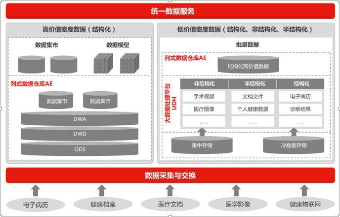
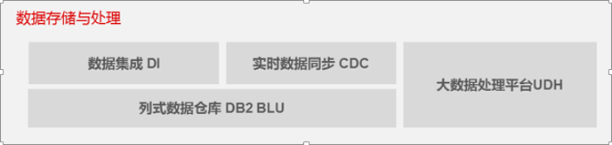

>来自：用友技术学院

>作者：艾尚坤

>连接：

>编辑:郭琪

# 数据中心

## 一、业务需求：

（1）异构系统业务集成与数据集成

（2）统一的业务语言及模型

（3）结构化数据和非结构化数据（XML，JSON，文档等）混合存储，统一管理

（4）同时支持业务应用与数据分析

（5）支持大量读操作和少量直接写操作

## 二、解决方案：

（1）根据数据和业务场景，可选用列式数据仓库AE与大数据处理引擎UDH的混合架构

（2）通过统一查询层屏蔽底层数据差异

## 三、应用价值：

1、大量数据的存储。集成涵盖企业的各个异构业务系统的数据、各种格式的数据

2、大量数据实时查询展现。通过实时同步技术，系统过程数据实时同步到数据中心，为用户提供涵盖历史数据和实时数据的秒级查询系统，同时提供实时的计算分析能力

3、支持业务分析、数据挖掘应用

4、支持低成本的扩展

## 四、关键技术：

*主数据管理、元数据管理*

