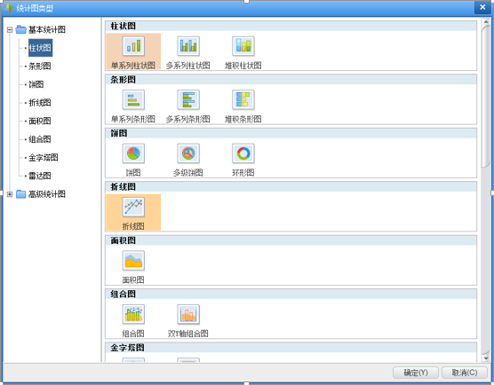
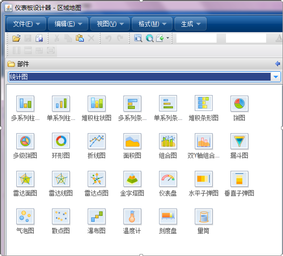

>来自：用友技术学院

>作者：艾尚坤

>连接：

>编辑:郭琪

# 统计图

**统计图**是利用点、线、面、体等绘制成各种几何图形，以表示各种数量间的关系及其变动情况。主要用于表现统计数字大小和变动的各种图形。它使复杂的统计数字简单化、通俗化、形象化，使人一目了然，便于理解和比较。它的**主要用途**是：表示数字间的对比关系；揭露总体结构；检查计划的执行情况；揭示现象间的依存关系，反映总体单位的分配情况；说明现象在空间上的分布情况。

**统计图**是在自由报表、多维分析、仪表板设计器中公共的图形部分（*FusionCharts图表*），主要图表类型包括：柱形图、堆积柱形图、条形图、饼图、多级饼图、折线图、面积图、组合图、双Y轴组合图、仪表盘、子弹图、雷达图、漏斗图、气泡图、散点图、瀑布图、子弹图等；它的数据源主要支持语义模型和多维模型；它支持**交互操作方式**主要包括：钻取、链接、联动、切换维度、切换指标、过滤、分组、排序/TopN、预警。

