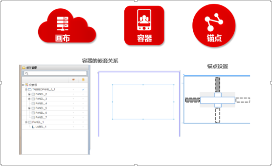
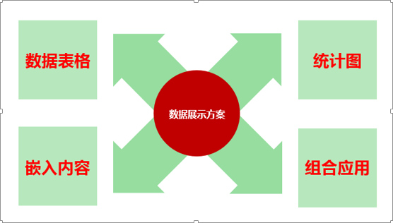
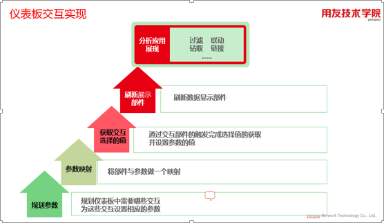

> 来自：用友技术学院
> 
> 作者：艾尚坤
> 
> 链接：http://udn.yyuap.com/doc/train/bigdata/yibiao_ban_md.html
> 
> 编辑: 郭琪

# 仪表板

**仪表板**（_Dashboard_）：根据特定的综合信息需求，可嵌入包括数据、交互、布局等部件，为用户提供综合分析支持；仪表板主要适用于解决有格式布局、部件间有联动要求的综合业务分析应用。

仪表板的**主要目标**是根据特定的综合信息需求，可嵌入包括报表、分析等部件，为用户提供综合分析支持。仪表板主要适用于解决有格式布局、部件间有联动要求的综合业务分析应用。仪表板作为通用的企业级仪表板设计工具，支持数据库、语义层对象、多维模型对象作为数据源；仪表板工具是用友BQ设计工具的有机组成部分，它可与建模工具无缝集成，并可方便使用建模工具的建模成果。

## 1. 仪表板内容

### 1.1  布局控制

灵活布局，包括容器、页签等布局组件，部件大小支持随布局部件保持固定值、按绝对值、按比例大小等多种变化方式，可适应多种布局场景需求。

### 1.2 数据展现

数据对象部件绑定数据源支持多种，包括语义模型、多维模型、自定义。

### 1.3 交互控制

丰富的部件交互方式，支持参数、脚本编程，可实现数据刷新，过滤、排序、联动、预警、链接等。

