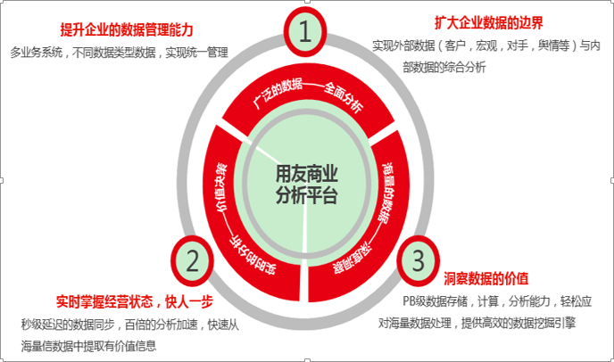

> 来自：用友技术学院
> 
> 作者：艾尚坤
> 
> 链接：http:\/\/udn.yyuap.com\/doc\/train\/bigdata\/yongyou\_shang\_ye\_fen\_xi\_ying\_yong\_fang\_an\_ti\_xi\_md.html
> 
> 编辑:郭琪

# 用友商业分析应用方案体系

用友具备完整的商业分析应用方案体系，来帮助企业持续提高分析决策能力。

方案体系涵盖了数据治理、商业分析模型、大数据处理、持续运营服务，可给用户按需提供用友商业分析（行业）解决方案、用友企业绩效分析解决方案、用友分析云解决方案、用友大数据解决方案、用友数据中心（数据仓库）解决方案等各类解决方案。

**用友商业分析应用方案的客户价值**：数据驱动、全景分析、洞察全局、智取未来

