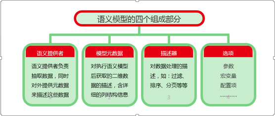

# 语义模型

**语义模型**既是一个自描述的数据容器，也是一个标准的数据交换接口，它把面向技术的数据，组织成面向业务的数据，供业务人员查询分析使用。
组成部分

## 1、	语义提供者

语义提供者，表述了一类取数方式，或者说如何提供数据的方式。在语义模型中，语义提供者负责把一类业务取数过程以语义脚本的形式描述出来。

## 2、	模型元数据

语义模型的元数据是对执行语义模型后获取的二维数据的描述。元数据针对结果数据的每一列都提供了下列信息：数据类型、字段显示名、字段名、备注、长度、精度 等

## 3、	描述器

描述器是指对数据操作的描述，例如：过滤、排序、分页、汇总 等。在语义模型中，描述器表述了对语义提供者抽取的数据的加工处理过程。

## 4、	选项

语义模型中的选项包括三类数据：参数、宏变量、配置项

### 	参数
参数是模型中代表动态信息的元素,用于响应用户的输入。参数给用户提供了控制模型执行过程的机会。

### 	宏变量

宏变量与参数类似，区别是，参数在模型执行时需要用户输入值；而宏变量不需要与用户交互，系统后台会根据上下文计算该值。

### 	配置项

配置项用于控制语义模型的执行方式。

