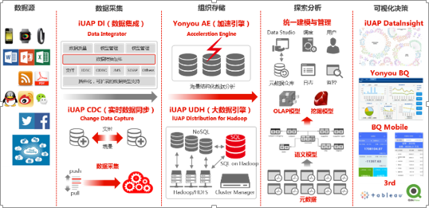
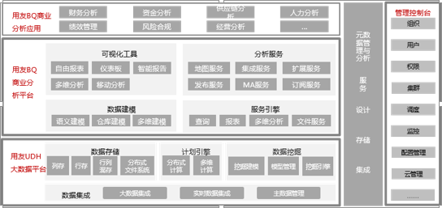

> 来自：用友技术学院
> 
> 作者：艾尚坤
> 
> 连接：http:\/\/udn.yyuap.com\/doc\/train\/bigdata\/zhengti\_ji\_zhu\_fang\_an\_md.html
> 
> 编辑:郭琪

# 整体技术方案

大数据的解决不是单一产品能够解决的，它需要一整套的解决方案，要融合很多传统的、新的技术。要构建大数据分析型企业，从大数据中挖掘出价值，企业首先需要一个可扩展、灵活而可管理的数据基础架构。

## 用友企业大数据平台是什么？

经过企业信息化建设的不断成熟，企业建设了多个业务系统，如ERP系统、财务系统、预算管理系统、采购管理系统、项目管理系统、人力资源管理系统等等。与此同时，随着企业业务的不断拓展，企业也不可避免的与外部系统也不断进行数据交换，例如企业的供应链数据、外部平台的销售数据、商品的物流数据甚至社交网络上的客户评价等等。

用友企业大数据平台是为了帮助企业处理分析这些内外部系统数据的一系列工具合集，能够支持对企业内部数据以及互联网相关数据的采集、存储、处理、分析、展现，包括结构化和非结构化数据，同时通过云服务和移动服务的形式增强了用户随时随地对数据进行分析的能力。

用友企业大数据平台包括两个产品系列：数据处理平台和商业分析平台。前者着重帮助企业进行数据的采集、加工和处理，后者帮助企业进行数据分析的模型、展现和分享能力。

## 用友企业大数据平台的整体技术方案

**在企业数据处理的四个阶段**：采集-组织存储—探索分析-可视化决策，用友都提供了解决方案和平台产品。

结构化数据和非结构化数据在统一的架构下进行处理和计算，可以接入hadoop分布式文件处理和mango db等分布式数据库，从而能够处理包括图像、视频、网站日志等非结构化和半结构化的数据。

**大数据处理**：所有产品都在一个集成统一的平台之中， 无需考虑任何集成，即可协同工作；统一、完善的元数据管理机制贯通业务和分析领域，为企业\/组织数据数据治理奠定技术基础；支持企业\/组织级传统数据处理和大数据处理需求。

## 用友企业大数据平台的整体架构

