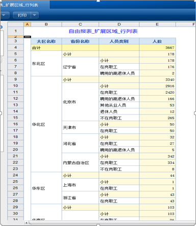
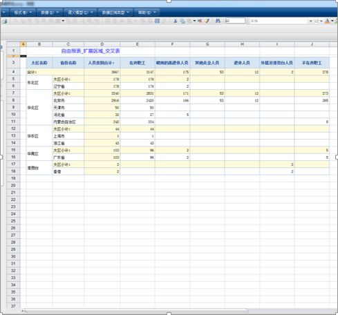
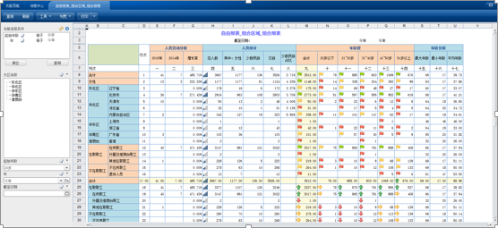
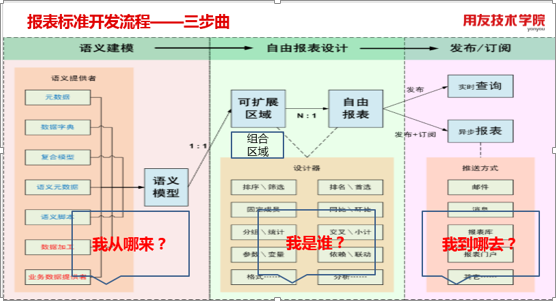
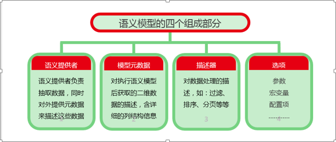
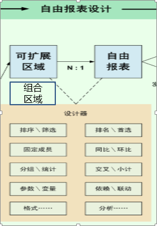
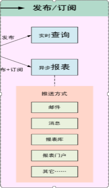

> 来自：用友技术学院
> 
> 作者：艾尚坤
> 
> 链接：http://udn.yyuap.com/doc/train/bigdata/ziyou_bao_biao_md.html
> 
> 编辑: 郭琪

# 自由报表

报表平台是为满足各类用户在报表分析方面的综合要求，所提供的一个分析型报表的解决方案。该解决方案的核心，就是基于语义模型对待展现分析数据的抽象，来定义自由报表，并进而为用户提供实时查询分析和定时订阅发布等应用服务。

## 1.报表平台具有以下特点

    针对企业不同业务角色，提供多样使用方式：报表数据查询人员可以在基于自由报表发布的查询节点中直接进行查询分析，而不需具备较深技术背景；专业的分析报表设计人员则可以全面使用设计功能实现复杂报表的定义和发布；

    支持多种数据来源：系统支持多种语义模型定义方式，还支持注册其他类型语义模型提供者，多来源数据都可以在一张自由报表中进行数据分析和展现；

    报表支持多区域模型，多个区域按照数据分析结果各自动态展开；多区域和多数据来源之间均可以设置依赖关系，能灵活组合拼装出各类样式的复杂报表；

    格式设计和报表展现效果一致：各种数据分析和格式设置都在设计界面有直观展现，特别是交叉表的设计方式突破以往，能够可视化的直接定义维度指标及各类展现效果；

    提供了分析图表功能：提供了各类常见图表分析功能；

    分析功能和交互性加强：全面支持排序\/过滤\/分组\/统计\/交叉\/排名函数\/TopN等分析功能，并具有页维度和待定参数等交互特性。

    支持数据追踪：自由报表中的明细数据和统计数据都支持追踪到原始数据。

## 2.自由报表的类型

自由报表有行列表、交叉表、组合报表。

**2.1行列表**：由行维度、列维度、统计指标组成，可对各维度字段进行合计、排序、筛选等操作。

**2.2交叉表**：由行维度、列维度、交叉指标构成，其中指标可以横向、纵向展现。同样可对各维度字段进行排序、筛选、合计等操作。

**2.3组合报表**：由组合区域扩展而来，通过设置统计栏目、统计指标、统计条件。并对区域栏目进行设置后得出。

# 自由报表开发流程三部曲

语义建模——&gt;自由报表设计——&gt;发布订阅

# 语义模型

**语义模型**既是一个自描述的数据容器，也是一个标准的数据交换接口，它把面向技术的数据，组织成面向业务的数据，供业务人员查询分析使用。
组成部分

## 1、    语义提供者

语义提供者，表述了一类取数方式，或者说如何提供数据的方式。在语义模型中，语义提供者负责把一类业务取数过程以语义脚本的形式描述出来。

## 2、    模型元数据

语义模型的元数据是对执行语义模型后获取的二维数据的描述。元数据针对结果数据的每一列都提供了下列信息：数据类型、字段显示名、字段名、备注、长度、精度 等

## 3、    描述器

描述器是指对数据操作的描述，例如：过滤、排序、分页、汇总 等。在语义模型中，描述器表述了对语义提供者抽取的数据的加工处理过程。

## 4、    选项

语义模型中的选项包括三类数据：参数、宏变量、配置项

### 4.1    参数

参数是模型中代表动态信息的元素,用于响应用户的输入。参数给用户提供了控制模型执行过程的机会。

### 4.2    宏变量

宏变量与参数类似，区别是，参数在模型执行时需要用户输入值；而宏变量不需要与用户交互，系统后台会根据上下文计算该值。

### 4.3    配置项

配置项用于控制语义模型的执行方式。

# 自由报表设计类型

1、可扩展区域设计

2、组合区域设计

# 发布订阅类型

1、实时查询

2、异步报表

